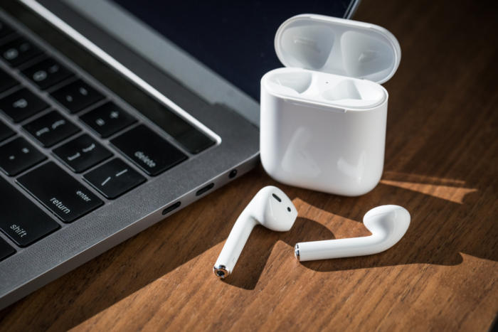

苹果在九月初的发布会上一口气发布了多款产品，最受瞩目的当然是iPhone 7。但是同时发布的耳机AirPods却并非仅仅是“iPhone 7没有了耳机插口”的替代解决方案。AirPods的意义非常大。

# 它意义非凡...

美银美林做的调查，AirPods在所有调查人群中的购买意愿为12%，超过Apple Watch 2的8%的购买意愿。一分为二看待这个数据，积极角度看，12%是来自所有被调查人群，而不是已有苹果设备的用户，所以这个被调人群对应的理想基数是全体美国人。John Gruber也认为如果这么想的话12%是相当高的数字。我们按照美国人口算一下，理想情况下AirPods将为苹果带来38亿美元的收入。消极角度看，调查时声称的购买意愿转化为真实的购买，这个过程中受很多因素影响，因此这个数据有一定水分。

除了为公司贡献可观的收入，AirPods的意义至少还有三点。

## 让耳机拥有智能
AirPods是苹果第一次涉及“智能耳机”这个品类。让耳机拥有智能并不是一个迫在眉睫的需求，没有大量的消费者声称需要它，也没有科技设备厂商认真对待它。在供需两方面都没有预期的时候，做什么都很容易超越预期。所以除了价格，没有谁不满意AirPods的功能。

AirPods在智能上设置了很可观的标准――正如以往苹果的设备，在它出来之后你会感觉：“手机（现在是智能耳机）本来就该是这个样子啊，以前那些难用的玩意究竟是怎么会存在这么久的？”

AirPods在智能化上有哪些功能？AirPods和手机的连接非常简单，尽管在通讯协议上使用的依然是Bluetooth，但是它和手机――尤其是iPhone的配对非常便捷。只需要将它从充电盒中拿出，靠近iPhone，即可完成连接。播放音乐方面，只要把AirPods放入耳朵，即可自动播放手机正在播放的音乐。暂停也很简单――把AirPods拿出耳朵即自动暂停。

## 增加Siri的使用场景
如果说以上这些“智能”是一些传感器和信号处理即可完成，是比较低级别的智能，那么真正让AirPods变得智能的，就是Siri。轻点两下AirPods，即可激活iPhone上的Siri。即使在嘈杂的环境中，AirPods也可以过滤掉环境噪音，和Siri对话。

AirPods极大地增加了Siri的使用场景――所有你无法方便地掏出手机的场景，你都可以假装你有一个私人助理在电话的那头――“下午下雨吗？”“定一个五点的闹钟。”“苹果现在的股价如何？”。没错，AirPods的出现，开始让智能手机向私人助理的方向进化。

关于智能手机，业界有两个问题。1）智能手机在未来将以一个什么形式存在？2）有其他设备可以替代智能手机的存在吗？苹果的回答是：1）私人助理。2）不能。

当然谷歌进行过尝试，用Google Glass眼镜代替智能手机。但是现在Google Glass 项目已经被谷歌停掉了，也就是说这种尝试暂时没有成功。

目前看来，我们不得不承认智能手机作为私人助理的核心地位。但是它的使用形态却不是一成不变的。AirPods给出了范例，它用语音的方式扩大了智能手机“可达性”的边界。这个边界未来还会扩大，但我并不想做太过浮夸的想象――好比在今天想象未来马路上跑的全是无人驾驶汽车，这是一句正确而无用的废话。所以从最近和最可行的角度上讲，语音就是未来五年最佳的人机交互模式了。

## 在听觉上增强现实
此外我还自作多情地认为，苹果在这里埋下了一个“增强现实”的伏笔。目前科技巨头大多在进行虚拟现实（创造一个逼真的虚拟世界）和增强现实（在现实场景叠加虚拟信息）的布局，而苹果未来会侧重的大概率是增强现实。CEO Tim Cook在公开场合明确表明在两者之中对增强现实的兴趣最大，而这也与苹果的基因最吻合。还记得乔布斯亲自配音的那则广告《The Crazy Ones》吗？

Here's to the crazy ones. 
The misfits. 
The rebels. 
The troublemakers. 
The round pegs in the square holes. 
The ones who see things differently.
…...
We make tools for these kinds of people.
…...
While some may see them as the crazy ones, we see genius. 
Because the people who are crazy enough to think that they can change the world, are the ones who do.

重温乔布斯的这种“给牛人造牛物”的精英理念，你觉得苹果会 make tools for 那些带着大大的眼镜沉溺在虚拟世界中的游戏玩家吗？我很怀疑。

那么在增强现实中，AirPods可以做什么呢？其实增强现实不仅是眼睛的游戏――让你在桌子上看到不存在的模型；也是耳朵的游戏――比如让你听到你更想听到的声音。

已经有初创公司做出了这样的耳机（Here One），可以通过滤波器将你不喜欢的某种声音去除，将你喜欢的某种声音放大。比如在咖啡馆中，将嘈杂的背景音移除，而将你对面朋友的说话声放大。和大众对苹果“创新”的印象并行不悖的是，它其实一直非常善于学习――比如iOS的iMessanger对Line等聊天软件的大量借鉴。如果有一天AirPods上增加类似Here One的增强现实功能，我也并不感到惊讶。

# 它的成功却受限于...

AirPods要想改变未来的人机交互模式，并配得上更丰富的想象，目前还受限于三点因素。

第一，更便宜的价格和更理想的续航。目前在国内的售价1299元，相比其他蓝牙耳机贵了太多，要想有真正的吸引力，需要做到 apple watch 这种定价策略，即大概比竞争者贵不超过1/3左右。

续航方面，我认为目前的耳机5小时+充电盒提供24小时，会比大家想的要够用。但对打电话比较多的人士，在平常上班期间（即“不带充电盒而全靠耳机的5小时”这一使用场景）不一定够用。增加到耳机8小时+充电盒24小时会比较保险。

第二，Siri理解能力的提升。Siri目前对于嵌套问题的能力几本不存在，即在上一个问题的答案的背景下提下一个问题。而三星最近并购的ViV已经有了这方面的能力。此外，Siri对其他语种的支持比起英语的支持又要更弱，而如果切到英文，它又理解不了当地语言的地名，比如在英文Siri中，无论你用什么方式说“Shanghai”，它都不能理解。所以如果你要说“Shanghai Railway Station”，你就需要先说“Railway Station”，然后手动从列表中选择。

如果Siri不能快速赶上语音识别和自然语言处理这两个领域的顶尖水平，就无法教育消费者把AirPods当私人助理来用，那么AirPods的用途将大打折扣。

第三，摆脱对网络的依靠。在这个所有服务都逐渐往云上迁移的时代，呼吁“离线”似乎有点不合时宜。但是如果希望私人助理有快速的响应，就不能依赖于网络。

我们类比一下PC的发展。在计算机刚诞生的时候，没有人认为人人都需要计算机。计算机科学家认为，每个人只需要一个终端，他们从各自的终端上访问同一台主机就可以了。而比尔盖茨希望让每一个家庭每一个办公桌上都有一台电脑，最后是他对了。

为什么比尔盖茨是正确的呢？如果想拥有计算机快速的计算速度，快速的读写能力，就必须独占计算机，不依赖于网络。PC发展到今天，宽带建设到今天，谷歌的“完全依赖云”的笔记本chromebook依然没能获得成功，就是因为在全世界绝大多数地区，宽带速度根本无法支撑大量数据的快速传输。

如果Siri想像人类一样快速响应用户的问题，就要把语音识别和人工智能算法的绝大多数部署在智能手机上，只在必要的时候才从云上同步。我们每个人都需要一个本地的私人助理，就像我们每个人都需要一台本地的计算机――在网络拥塞的都市或者信号不好的山区，唯有能够离线的私人助理才能被信赖。

# 那么对国内公司的影响是...

假设AirPods能够取得成功，将教育消费者养成语音交互的使用习惯。接下来根据国内手机厂商的模仿速度，第一步会在语音交互和语音智能上下大工夫，各品牌的旗舰手机一定会配有能用、好用的语音助理；第二步各家手机厂商会逐渐为手机配套智能耳机。

国内的模仿的趋势对整个语音识别和自然语言处理领域都有很大的利好。而在这两个方面都有比较长期积累的是A股上市公司科大讯飞（002230）。其在国内智能语音市场占有率超过50%。智能语音方面毕竟不是手机厂商的强项，他们和成熟的智能语音公司合作是必然的选择，像小米目前自带的语音助手就是使用的科大讯飞的引擎。

但这一趋势对科大讯飞的提振还要考虑智能语音对其整体业务的贡献。根据科大讯飞2015年的财务报表，智能语音基础技术营收只占到其整体营收的12%，即使该部分营收2016年提升50%，对整体的贡献也仅为6%，智能语音基础技术的需求增加并不能对该公司财务状况起决定性作用。

对于初创公司来讲又不一样了，根据我的一位在智能交互机器人领域创业的同学所说，目前中国有数百家公司都在从事此类研发。如果用户习惯养成，势必导致智能语音助理在整个硬件行业的渗透率大幅度提升，这个新兴市场容纳的资金将能够维持大量初创公司的健康存活。

虽然影响程度不尽相同，但智能语音这个领域无论是上市公司还是初创公司，受到的关注都会极大增加，它们都会从这个迅速增长的市场中受益。

