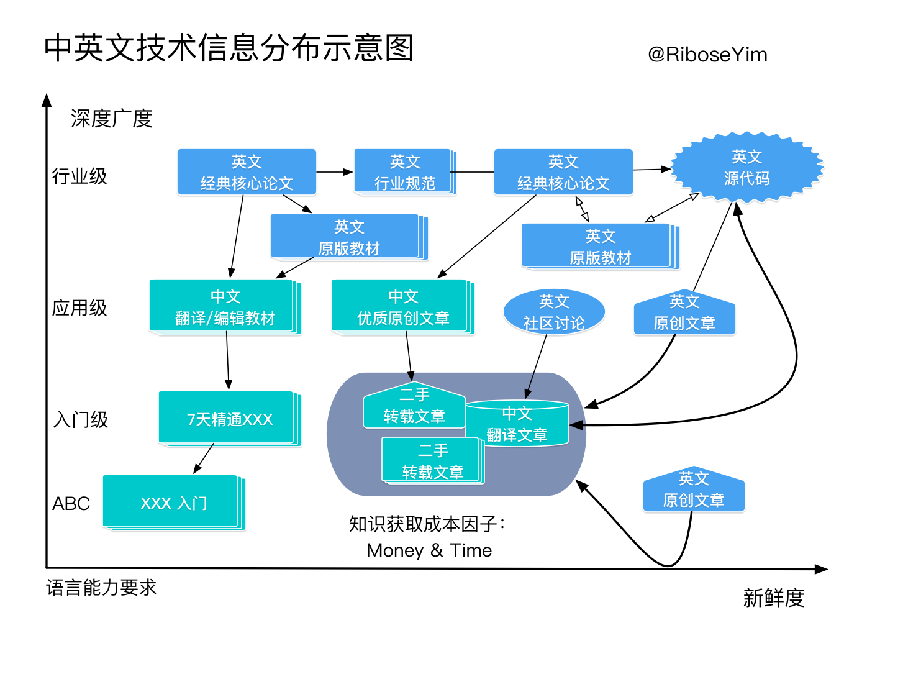

机械工业出版社的计算机专业书籍华章系列中，开篇都有这么一段《出版者的话》：

>文艺复兴以降，源远流长的科学精神和逐步形成的学术规范，使西方国家在自然科学的各个领域取得了垄断性的优势，也正是这样的传统，使美国在信息技术发展的六十年间名家辈出、独领风骚。在商业化的进程中，美国的产业界和教育界越来越紧密地结合，计算机学科中的许多泰山北斗同时身处科研和教学的最前线，由此产生的经典科学著作，不仅擘划了研究的范畴，还揭示了学术的源变，既遵循学术规范，又自有学者个性，其价值并不会因年月的流逝而减退。

就GDP而言，中国是世界第二大经济体。改革开放四十年来，中国低调做事，“闷声发大财”，成果不可谓不显著。然而，进来风向变化，似有企图开创“万国来朝时代”的声音嗡嗡作响，这若不是蓄意破坏，就是蠢得作死了。

传统工业的差距虽然有所耳闻，毕竟不是专业，不敢多言。计算机行业来看，虽然我们有世界上领先的IT企业，但他们真正赖以生存的赚钱来源是“商业模式创新”，这都拜中国庞大市场所赐，“中文”和“国境”这两大天然壁垒，构成了这些企业的“护城河”。如果就此认为我们的IT已经领先，头脑实在不清楚。

计算机领域的标准化掌握在英文世界，最优秀的论文和高质量的源代码掌握在英文世界，即便国内所谓“自主开发”的软件，也大多来自国外开源代码或商业产品的逆向工程。不信把GitHub关掉，看看国内软件企业的所谓“创新”还能剩下多少？

下面是我很喜欢的一幅图，展示了IT领域知识分布的现状，英文世界仍处于源头位置([来源](https://riboseyim.gitbooks.io/linux-perf-master/content/chapter/thinking/Technology-English.html)):

从这个角度来看，想几十年就在科技上领先世界，可不能仅仅从**企业营收、企业净利润**这些数字来看，而要从**顶尖大牛的数量、高端人才的数量、理论研究的领先程度、工业实践的领先程度、影响行业的开源项目数量**这些数字来看。

这些数字，几十年是否有超越美国的可能？我的结论是，如果美国就此不动等死，有可能。可是美国是否在政治体制、经济发展、人才流入上出现了什么足以全面停摆的问题？答案是显而易见的。

所以，还是**闷声发大财**比较好。